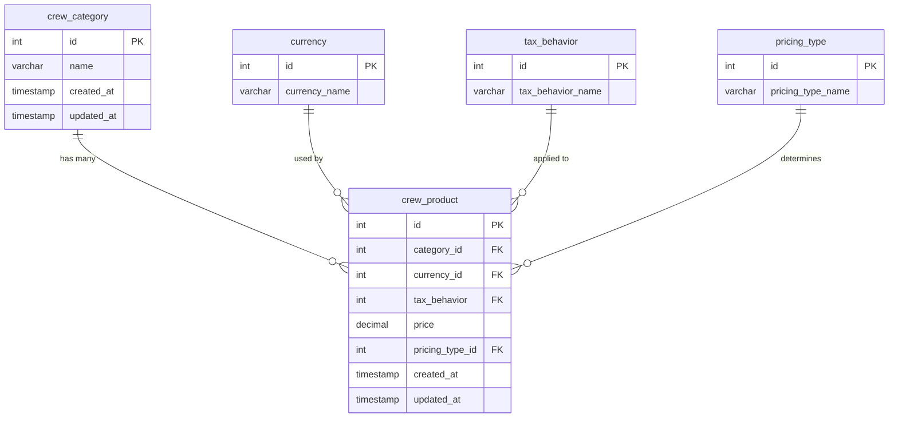

# Crew Tables Guide

This document describes the crew management system tables and their relationships.

## Table Structure

### 1. crew_category Table

Stores different categories of crew members.

| Column | Type | Constraints | Description |
|--------|------|-------------|-------------|
| `id` | SERIAL | PRIMARY KEY | Unique identifier |
| `name` | VARCHAR(255) | NOT NULL, UNIQUE | Category name (e.g., "Pilot", "Flight Attendant") |
| `created_at` | TIMESTAMP WITH TIME ZONE | DEFAULT NOW() | Record creation timestamp |
| `updated_at` | TIMESTAMP WITH TIME ZONE | DEFAULT NOW() | Record last update timestamp |

**Default Categories:**
- Pilot
- Flight Attendant
- Ground Crew
- Maintenance
- Security
- Catering
- Cleaning
- Administrative

### 2. crew_product Table

Stores pricing information for different crew categories.

| Column | Type | Constraints | Description |
|--------|------|-------------|-------------|
| `id` | SERIAL | PRIMARY KEY | Unique identifier |
| `category_id` | INTEGER | NOT NULL, FK to crew_category.id | Reference to crew category |
| `currency_id` | INTEGER | NOT NULL, FK to currency.id | Reference to currency |
| `tax_behavior` | INTEGER | NOT NULL, FK to tax_behavior.id | Reference to tax behavior |
| `price` | DECIMAL(10,2) | NOT NULL, CHECK (price > 0) | Price amount |
| `pricing_type_id` | INTEGER | NOT NULL, FK to pricing_type.id | Reference to pricing type |
| `created_at` | TIMESTAMP WITH TIME ZONE | DEFAULT NOW() | Record creation timestamp |
| `updated_at` | TIMESTAMP WITH TIME ZONE | DEFAULT NOW() | Record last update timestamp |

## Relationships



## Foreign Key Relationships

- **crew_product.category_id** → **crew_category.id**
  - ON DELETE CASCADE: If a category is deleted, all related products are deleted
- **crew_product.currency_id** → **currency.id**
  - ON DELETE RESTRICT: Prevents deletion of currencies that are in use
- **crew_product.tax_behavior** → **tax_behavior.id**
  - ON DELETE RESTRICT: Prevents deletion of tax behaviors that are in use
- **crew_product.pricing_type_id** → **pricing_type.id**
  - ON DELETE RESTRICT: Prevents deletion of pricing types that are in use

## Indexes

Performance indexes are created on:
- `crew_product.category_id`
- `crew_product.currency_id`
- `crew_product.tax_behavior`
- `crew_product.pricing_type_id`

## Row Level Security (RLS)

Both tables have RLS enabled with policies that allow:
- **SELECT**: Authenticated users can view records
- **INSERT**: Authenticated users can create records
- **UPDATE**: Authenticated users can modify records
- **DELETE**: Authenticated users can delete records

## Sample Data

The migration includes sample crew products:

| Category | Price | Currency | Tax Behavior | Pricing Type |
|----------|-------|----------|--------------|--------------|
| Pilot | $150.00 | USD | Tax Exclusive | Per Person |
| Flight Attendant | $75.00 | USD | Tax Exclusive | Per Person |
| Ground Crew | $60.00 | USD | Tax Exclusive | Per Person |
| Maintenance | $80.00 | USD | Tax Exclusive | Per Person |
| Security | $65.00 | USD | Tax Exclusive | Per Person |

## Usage Examples

### Query crew products with related data
```sql
SELECT 
    cp.id,
    cp.price,
    cc.name as category_name,
    c.currency_name,
    tb.tax_behavior_name,
    pt.pricing_type_name
FROM crew_product cp
JOIN crew_category cc ON cp.category_id = cc.id
JOIN currency c ON cp.currency_id = c.id
JOIN tax_behavior tb ON cp.tax_behavior = tb.id
JOIN pricing_type pt ON cp.pricing_type_id = pt.id;
```

### Insert new crew product
```sql
INSERT INTO crew_product (category_id, currency_id, tax_behavior, price, pricing_type_id)
VALUES (1, 1, 2, 200.00, 1);
```

### Update crew product price
```sql
UPDATE crew_product 
SET price = 175.00, updated_at = NOW()
WHERE id = 1;
```

## TypeScript Integration

Use the provided TypeScript interfaces in `lib/types/crew.ts` for type safety:

```typescript
import { CrewProduct, CrewCategory, CreateCrewProductRequest } from '@/lib/types/crew';

// Create a new crew product
const newProduct: CreateCrewProductRequest = {
  category_id: 1,
  currency_id: 1,
  tax_behavior: 2,
  price: 200.00,
  pricing_type_id: 1
};
```

## Migration

To apply these tables to your database:

1. Run the migration: `supabase db push`
2. Or manually execute the SQL in `supabase/migrations/016_create_crew_tables.sql`

## Notes

- All prices are stored as DECIMAL(10,2) for precision
- Timestamps are automatically managed
- RLS ensures data security
- Foreign key constraints maintain data integrity
- Indexes optimize query performance
