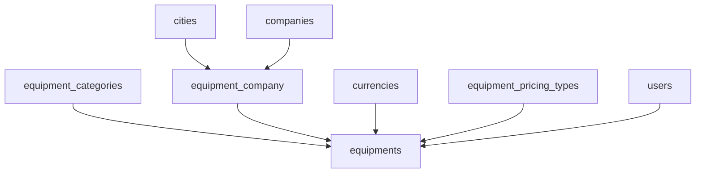

# Equipment Management System Guide

## Overview

The Equipment Management System provides a comprehensive solution for managing equipment inventory, categories, companies, and pricing. This system integrates seamlessly with your existing hotel and safari operations and features a tabbed interface similar to your hotels page.

## System Structure

### Tabbed Interface
The equipment management system is organized into three main tabs:

1. **Equipment Categories** - Manage equipment types and classifications
2. **Equipment Companies** - Manage equipment suppliers and companies
3. **Equipments** - Manage individual equipment items with pricing

## Database Structure

### Core Tables

#### 1. `equipment_categories`
- **Purpose**: Categorize equipment types
- **Key Fields**: `id`, `name`, `is_active`, `owner_id`
- **Example Categories**: Camping Gear, Safari Vehicles, Photography Equipment, etc.

#### 2. `equipment_company`
- **Purpose**: Manage equipment suppliers/companies
- **Key Fields**: `id`, `name`, `city_id`, `company_id`, `is_active`
- **Features**: Location-based companies, parent company associations

#### 3. `equipments`
- **Purpose**: Main equipment inventory
- **Key Fields**: `id`, `category_id`, `company_id`, `name`, `currency_id`, `price`, `owner_id`, `pricing_type_id`
- **Features**: Multi-currency support, flexible pricing types

#### 4. `currencies`
- **Purpose**: Support multiple currencies
- **Key Fields**: `id`, `code`, `name`, `symbol`
- **Supported**: USD, TZS, EUR, GBP

#### 5. `equipment_pricing_types`
- **Purpose**: Define pricing structures
- **Key Fields**: `id`, `name`, `description`
- **Types**: Daily, Weekly, Monthly, Hourly, One-time

### Relationships



## Features by Tab

### 1. Equipment Categories Tab

#### **CRUD Operations**
- ✅ **Create**: Add new equipment categories
- ✅ **Read**: View all categories with search and pagination
- ✅ **Update**: Edit category names and status
- ✅ **Delete**: Remove categories (with confirmation)

#### **Features**
- **Search**: Find categories by name
- **Status Management**: Active/Inactive toggle
- **Owner Tracking**: Track who created each category
- **Pagination**: Navigate through large category lists

#### **Usage**
1. **Add Category**: Click "Add Category" → Enter name → Set active status → Save
2. **Edit Category**: Click edit icon → Modify name/status → Update
3. **Delete Category**: Click delete icon → Confirm deletion
4. **Search**: Use search bar to filter categories

### 2. Equipment Companies Tab

#### **CRUD Operations**
- ✅ **Create**: Add new equipment companies with city and parent company
- ✅ **Read**: View all companies with related data
- ✅ **Update**: Edit company details, location, and parent company
- ✅ **Delete**: Remove companies (with confirmation)

#### **Features**
- **Location-based**: Link companies to specific cities
- **Parent Company Association**: Connect to existing company structure
- **Advanced Search**: Search by company name, city, or parent company
- **Status Management**: Active/Inactive toggle

#### **Usage**
1. **Add Company**: Click "Add Company" → Enter name → Select city → Select parent company → Set status → Save
2. **Edit Company**: Click edit icon → Modify details → Update
3. **Delete Company**: Click delete icon → Confirm deletion
4. **Search**: Use search bar to filter by company, city, or parent company

### 3. Equipments Tab

#### **CRUD Operations**
- ✅ **Create**: Add new equipment with full details
- ✅ **Read**: View all equipment with comprehensive information
- ✅ **Update**: Edit equipment details, pricing, and associations
- ✅ **Delete**: Remove equipment (with confirmation)

#### **Features**
- **Multi-currency Support**: USD, TZS, EUR, GBP with symbols
- **Flexible Pricing**: Daily, weekly, monthly, hourly, one-time rates
- **Category Association**: Link to equipment categories
- **Company Association**: Link to equipment companies
- **Advanced Filtering**: Filter by category, company, or search terms
- **Formatted Pricing**: Display prices with currency symbols and pricing types

#### **Usage**
1. **Add Equipment**: Click "Add Equipment" → Fill all required fields → Save
2. **Edit Equipment**: Click edit icon → Modify details → Update
3. **Delete Equipment**: Click delete icon → Confirm deletion
4. **Filter**: Use search bar and dropdown filters to find specific equipment

## Database Migration

Run the migration to set up the equipment system:

```sql
-- Execute the migration file
-- supabase/migrations/007_equipment_management_system.sql
```

This migration will:
- Create all necessary tables
- Set up foreign key relationships
- Insert sample data (categories, currencies, pricing types)
- Configure Row Level Security (RLS) policies
- Create indexes for performance
- Create views for easy data access
- Create utility functions

## Sample Data

### Equipment Categories
- Camping Gear
- Safari Vehicles
- Photography Equipment
- Water Sports Equipment
- Kitchen Equipment
- Medical Supplies
- Communication Devices
- Safety Equipment

### Currencies
- USD ($) - US Dollar
- TZS (TSh) - Tanzanian Shilling
- EUR (€) - Euro
- GBP (£) - British Pound

### Pricing Types
- Daily - Price per day
- Weekly - Price per week
- Monthly - Price per month
- Hourly - Price per hour
- One-time - One-time rental fee

## Integration with Existing System

### 1. Safari Quote Integration
The equipment system can be integrated with your Safari Quote page to:
- Add equipment rentals to quotes
- Calculate equipment costs
- Select equipment by location/company

### 2. Hotel Operations
Equipment can be used for:
- Hotel maintenance equipment
- Kitchen and service equipment
- Guest amenities and services

### 3. Company Structure
Equipment companies are linked to:
- Cities (location-based)
- Parent companies (organizational structure)

## Security Features

### Row Level Security (RLS)
- **Equipment Categories**: Users can only modify their own categories
- **Equipment**: Users can only modify their own equipment
- **Equipment Companies**: Public read access, authenticated write access

### Data Validation
- **Unique Constraints**: Prevent duplicate names per owner/company
- **Required Fields**: All essential fields are mandatory
- **Foreign Key Constraints**: Maintain data integrity

## Performance Optimizations

### Indexes
- `idx_equipments_category_id` - Fast category filtering
- `idx_equipments_company_id` - Fast company filtering
- `idx_equipments_owner_id` - Fast owner-based queries
- `idx_equipments_pricing_type_id` - Fast pricing type filtering

### Views
- `equipment_details` - Pre-joined view for all equipment data
- Reduces query complexity and improves performance

### Functions
- `get_equipment_by_category()` - Filter equipment by category
- `get_equipment_by_company()` - Filter equipment by company

## User Interface Features

### Consistent Design
- **Tabbed Interface**: Similar to hotels page for consistency
- **Search Functionality**: All tables support search
- **Pagination**: Handle large datasets efficiently
- **Modal Forms**: Clean add/edit interfaces
- **Status Indicators**: Visual badges for active/inactive items
- **Action Buttons**: Edit and delete operations

### Responsive Design
- **Mobile-friendly**: Works on all screen sizes
- **Accessible**: Proper labels and keyboard navigation
- **Loading States**: Clear feedback during data operations

## Future Enhancements

### Potential Features
1. **Equipment Bookings**: Track equipment rentals and availability
2. **Maintenance Tracking**: Schedule and track equipment maintenance
3. **Inventory Management**: Track equipment quantities and stock levels
4. **Cost Analytics**: Analyze equipment costs and profitability
5. **Integration APIs**: Connect with external equipment suppliers
6. **Mobile App**: Equipment management on mobile devices

### Database Extensions
1. **Equipment Bookings Table**: Track rental periods and clients
2. **Maintenance Records Table**: Track service history
3. **Equipment Images Table**: Store equipment photos
4. **Equipment Specifications Table**: Detailed technical specifications

## Troubleshooting

### Common Issues

1. **"Equipment not found"**
   - Check if the equipment exists in the database
   - Verify RLS policies are correctly configured

2. **"Cannot add equipment"**
   - Ensure all required fields are filled
   - Check if the user is authenticated
   - Verify foreign key relationships exist

3. **"Filter not working"**
   - Check if the selected category/company exists
   - Verify the data is properly loaded

4. **"Foreign key constraint error"**
   - Ensure referenced records exist (cities, companies, categories)
   - Check that IDs are valid

### Debug Queries

```sql
-- Check equipment data
SELECT * FROM app_8649.equipment_details LIMIT 10;

-- Check categories
SELECT * FROM app_8649.equipment_categories WHERE is_active = true;

-- Check companies
SELECT * FROM app_8649.equipment_company WHERE is_active = true;

-- Check currencies
SELECT * FROM app_8649.currencies WHERE is_active = true;

-- Check equipment companies with related data
SELECT 
    ec.name as company_name,
    c.name as city_name,
    pc.name as parent_company_name
FROM app_8649.equipment_company ec
LEFT JOIN app_8649.cities c ON ec.city_id = c.id
LEFT JOIN app_8649.companies pc ON ec.company_id = pc.id;
```

## Support

For technical support or questions about the Equipment Management System:
1. Check this guide for common solutions
2. Review the database migration file for schema details
3. Examine the React component code for implementation details
4. Check the browser console for any JavaScript errors
5. Verify database connections and RLS policies 